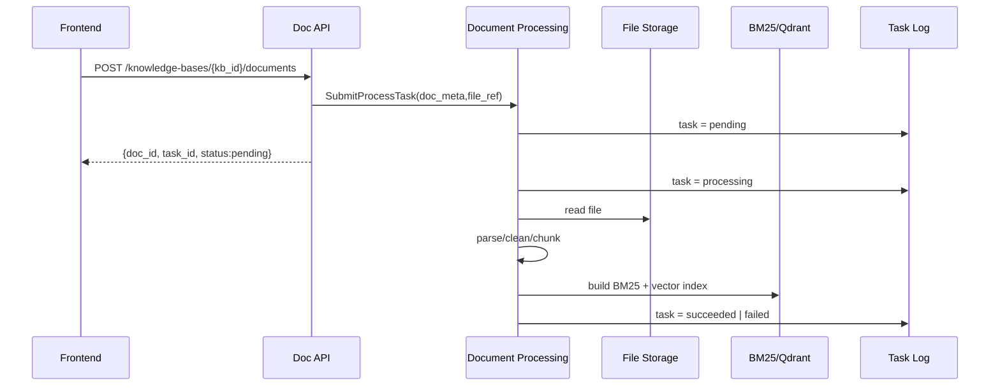
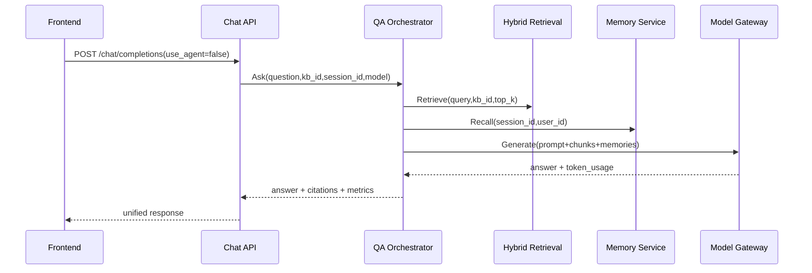
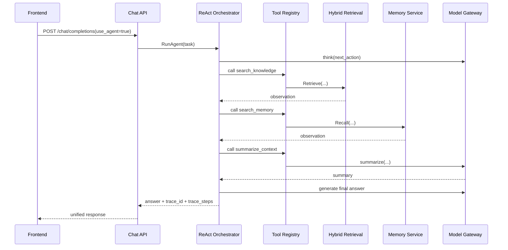
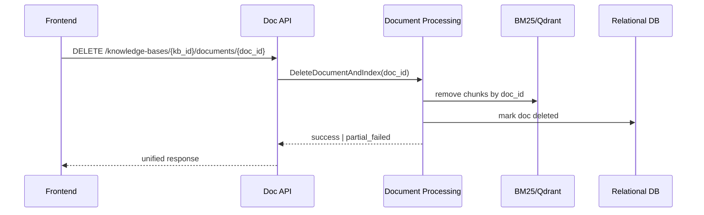

# 后端模块交互架构文档（MVP）

## 1. 文档目标

本文档聚焦后端模块之间“如何交互”，用于统一团队实现口径，避免跨层直连和职责混乱。

适用系统：`知忆（MemoBase）`

---

## 2. 后端分层与模块

后端按四层组织：

1. `API Layer`：`Auth API / KB API / Doc API / Chat API / Session API / Health API`
2. `Application Layer`：`问答编排服务 / 智能体编排服务 / 任务状态服务`
3. `Core Capability Layer`：`文档处理 / 混合检索 / 记忆管理 / 模型网关 / Agent Tools`
4. `Data & Infra Layer`：`RDB / Qdrant / BM25 Index / File Storage / External LLM / Local LLM`

依赖方向必须单向：`API -> Application -> Capability -> Data`

---

## 3. 模块职责与交互边界

## 3.1 API Layer

- 负责：参数校验、鉴权、路由、统一响应、错误码映射
- 不负责：检索策略、记忆策略、模型调用细节
- 交互方式：同步调用 Application Service

## 3.2 问答编排服务（QA Orchestrator）

- 负责：组织 `检索 -> 记忆 -> 模型生成 -> 引用组装`
- 依赖：`Hybrid Retrieval`、`Memory Service`、`Model Gateway`
- 输出：答案、引用、延迟、token 使用、可选 trace_id

## 3.3 智能体编排服务（ReAct Orchestrator）

- 负责：思考-行动-观察循环、工具调度、轨迹记录
- 依赖：`Tool Registry` + `Model Gateway`
- 工具白名单：`search_knowledge`、`search_memory`、`summarize_context`

## 3.4 文档处理服务（Document Processing）

- 负责：解析、清洗、切片、向量化、索引写入、任务状态更新
- 依赖：`File Storage`、`BM25 Index`、`Qdrant`、`Task Log Repo`
- 说明：上传接口与处理任务解耦，采用“提交任务 + 轮询状态”模式

## 3.5 混合检索服务（Hybrid Retrieval）

- 负责：`BM25 + 向量检索 + 融合排序 + 去重`
- 输入：`kb_id/query/top_k/weights`
- 输出：候选 chunk 列表（含 score 与 metadata）

## 3.6 记忆服务（Memory Service）

- 负责：短期/长期记忆召回、会话摘要写入
- 依赖：`RDB`（memory/session/message）
- 输出：可注入上下文，不直接返回最终答案

## 3.7 模型网关（Model Gateway）

- 负责：统一外置模型与本地模型调用协议、超时控制、失败降级
- 输入：统一 LLM 请求结构
- 输出：统一 LLM 响应结构（文本、token、耗时、模型标识）

## 3.8 任务状态服务（Task Status）

- 负责：文档处理、重建索引、智能体执行等长任务状态读写
- 状态建议：`pending -> processing -> succeeded | failed`

---

## 4. 模块交互矩阵（谁调用谁）

| 调用方 | 被调方 | 交互类型 | 触发场景 | 关键输出 |
|---|---|---|---|---|
| `Doc API` | `Document Processing` | 同步提交任务 + 异步执行 | 上传/重建索引 | `task_id`, `doc_id`, status |
| `Chat API` | `QA Orchestrator` | 同步 | 普通问答 | answer/citations |
| `Chat API` | `ReAct Orchestrator` | 同步 | `use_agent=true` | answer/trace |
| `QA Orchestrator` | `Hybrid Retrieval` | 同步 | 检索知识片段 | chunks[] |
| `QA Orchestrator` | `Memory Service` | 同步 | 召回短/长期记忆 | memories[] |
| `QA Orchestrator` | `Model Gateway` | 同步 | 生成最终答案 | llm_response |
| `ReAct Orchestrator` | `Tool:search_knowledge` | 同步 | Agent 工具调用 | chunks[] |
| `Tool:search_knowledge` | `Hybrid Retrieval` | 同步 | 检索知识 | chunks[] |
| `ReAct Orchestrator` | `Tool:search_memory` | 同步 | Agent 工具调用 | memories[] |
| `Tool:search_memory` | `Memory Service` | 同步 | 召回记忆 | memories[] |
| `ReAct Orchestrator` | `Tool:summarize_context` | 同步 | 上下文压缩 | summary |
| `Tool:summarize_context` | `Model Gateway` | 同步 | 摘要生成 | summary |
| `Document Processing` | `BM25/Qdrant` | 同步（任务内部） | 索引构建 | indexed chunks |
| `Health API` | `DB/Qdrant/Storage/ModelGateway` | 同步探活 | readiness 检查 | up/down |

---

## 5. 核心交互时序

## 5.1 文档上传与建索引



## 5.2 普通问答（不启用 Agent）



## 5.3 Agent 问答（ReAct）



## 5.4 删除文档与索引同步删除



---

## 6. 关键交互协议（内部 Service Contract）

建议统一以下最小接口，确保模块可替换：

```go
type RetrievalService interface {
    Retrieve(ctx context.Context, req RetrievalRequest) ([]Chunk, error)
}

type MemoryService interface {
    Recall(ctx context.Context, req RecallRequest) ([]Memory, error)
    Upsert(ctx context.Context, req UpsertMemoryRequest) error
}

type ModelGateway interface {
    Generate(ctx context.Context, req LLMRequest) (LLMResponse, error)
}

type AgentOrchestrator interface {
    Run(ctx context.Context, req AgentRunRequest) (AgentRunResult, error)
    GetTrace(ctx context.Context, traceID string) (Trace, error)
}
```

---

## 7. 失败处理与降级策略

1. 检索部分失败：`BM25` 或 `Qdrant` 单侧失败时允许降级到另一侧，并在响应标记 `degraded=true`。
2. 记忆召回失败：不阻断主问答流程，记录告警并返回空记忆。
3. 模型调用失败：优先重试同模型（短重试），再降级备选模型；仍失败返回 `UPSTREAM_ERROR`。
4. 文档索引失败：任务状态置 `failed`，保留错误详情供前端轮询与重试。
5. Agent 工具失败：中断当前 step，写入 trace 并由编排器决定继续或退出。

---

## 8. 可观测性与追踪传播

所有跨模块调用必须透传：

- `request_id`：一次 HTTP 请求唯一 ID
- `trace_id`：一次问答/Agent 执行链路 ID
- `user_id`、`kb_id`、`session_id`：业务维度标签

推荐指标：

- API：QPS、P95 延迟、错误率
- 检索：召回耗时、融合耗时、命中数
- 模型网关：调用耗时、token、失败率、模型维度成功率
- 文档处理：任务成功率、平均处理时长、失败原因分布
- Agent：step 数量、工具调用失败率、平均轨迹长度

---

## 9. 交互约束（必须遵守）

1. API 层禁止直接访问 `Qdrant/BM25/文件存储`。
2. 智能体工具禁止直接访问数据库，必须走 `Retrieval/Memory/ModelGateway` 服务。
3. 问答与 Agent 共享同一套 `Model Gateway` 与 `Retrieval Service`。
4. 长耗时操作（文档处理、重建索引）必须任务化，不阻塞 API 请求。
5. 所有模块统一响应与错误码语义，避免前端分支爆炸。

---

## 10. MVP 到增强版的演进

- MVP：单体服务内模块化（包级隔离）+ Docker/Compose + 健康检查
- 增强：按服务拆分（Retrieval/Memory/ModelGateway/Agent）+ K8s + Prometheus/Grafana

结论：先保证“模块边界清晰 + 契约稳定 + 主链路可跑”，再做物理拆分与治理增强。
