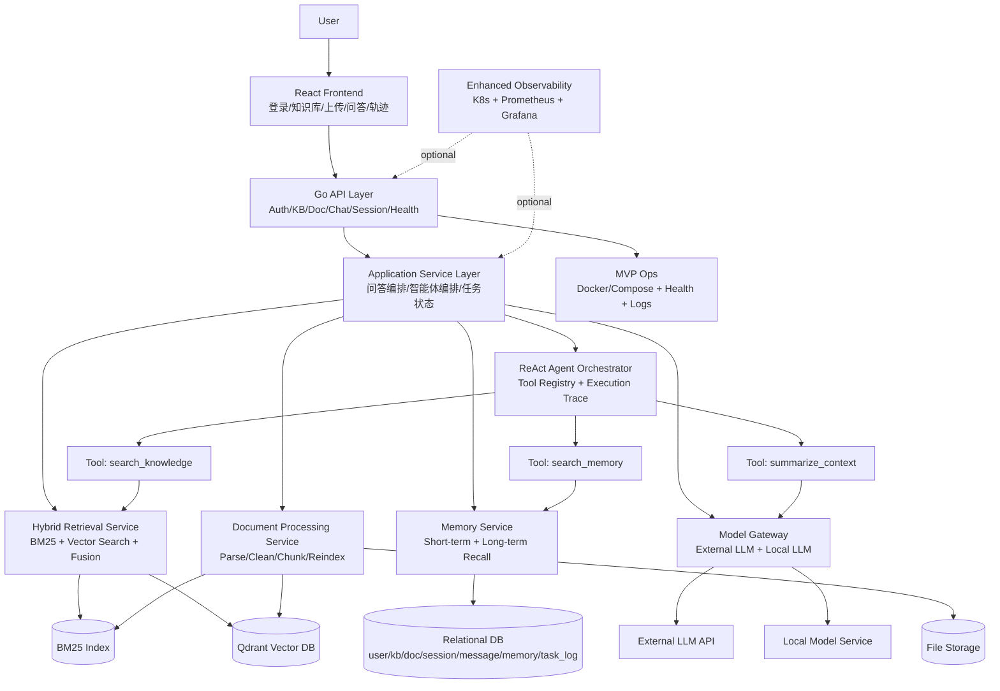

# 模块组织与系统架构说明

## 1. 文档目标
本说明用于统一团队对系统组织方式的理解，明确：
- 各模块如何分层与协作
- 请求从前端到检索/模型的完整流转
- 数据与基础设施在架构中的位置
- MVP 与增强能力在架构中的边界

适用项目：`知忆（MemoBase）`。

---

## 2. 总体组织原则

1. 前后端分离：前端只负责交互与展示，不承载核心业务规则。
2. 后端模块化：按“API 层 -> 业务编排层 -> 基础能力层 -> 存储层”组织。
3. 能力复用：检索、记忆、模型调用必须服务化，供问答与智能体共用。
4. 接口驱动协作：模块之间通过明确输入输出协议协作，避免跨层直连。
5. MVP 优先：先保证主链路可跑通，再逐步增加监控与部署增强能力。

---

## 3. 分层与模块关系

### 3.1 展示层（Frontend）
- 模块：登录、知识库管理、文档上传、问答交互、引用展示、会话历史、执行轨迹、基础运维页。
- 职责：调用后端 API，渲染状态与结果。
- 不负责：检索策略、模型调用、存储逻辑。

### 3.2 接口层（Backend API）
- 模块：鉴权 API、知识库 API、文档 API、问答 API、会话 API、健康检查 API。
- 职责：参数校验、鉴权、路由、统一响应。
- 不负责：底层实现细节（交给业务层和能力层）。

### 3.3 业务编排层（Application/Service）
- 模块：问答编排服务、智能体编排服务、任务状态管理。
- 职责：组织“检索 -> 记忆 -> 模型生成 -> 结果组装”的流程。
- 依赖：混合检索、记忆管理、模型网关。

### 3.4 基础能力层（Core Capabilities）
- 模块：
  - 文档处理（解析/清洗/切片/重建索引）
  - 混合检索（BM25 + Qdrant + 融合排序）
  - 记忆管理（短期/长期记忆存储与召回）
  - 智能体工具集（search_knowledge/search_memory/summarize_context）
  - 模型网关（外置模型 + 本地模型统一入口）
- 职责：提供稳定、可复用的能力接口。

### 3.5 存储与基础设施层（Data & Infra）
- 关系型数据库：用户、知识库、文档、会话、消息、记忆、任务日志。
- 向量数据库：Qdrant（chunk embedding + metadata）。
- 文件存储：原始文档与处理中间产物。
- 部署运维：
  - MVP：Docker / Docker Compose + 健康检查 + 日志排障
  - 增强：Kubernetes + Prometheus + Grafana

---

## 4. 模块协作主链路（MVP）

1. 用户上传文档（前端） -> 文档 API。
2. 文档处理模块完成解析、清洗、切片。
3. 索引构建：BM25 索引 + 向量化写入 Qdrant。
4. 用户提问（前端） -> 问答 API。
5. 问答编排调用：
   - 混合检索获取候选片段
   - 记忆管理召回上下文
   - 模型网关生成回答
6. 后端返回：答案 + 引用来源 + 可选执行轨迹。
7. 前端展示答案、引用、历史会话。

---

## 5. 完整架构图（Mermaid）

---

## 6. 组织协作建议（落地）

1. 前后端先锁定 API 契约（字段、状态码、错误码），再并行开发。
2. 文档处理、检索、记忆、模型网关统一由后端 service 层封装，禁止跨层直连。
3. 智能体工具只依赖服务接口，不直接访问数据库与向量库。
4. 每周联调至少覆盖一次“上传 -> 建索引 -> 提问 -> 回答展示”全链路。
5. 运维先交付 Docker 可复现环境，K8s/Prometheus/Grafana 作为增强里程碑。
